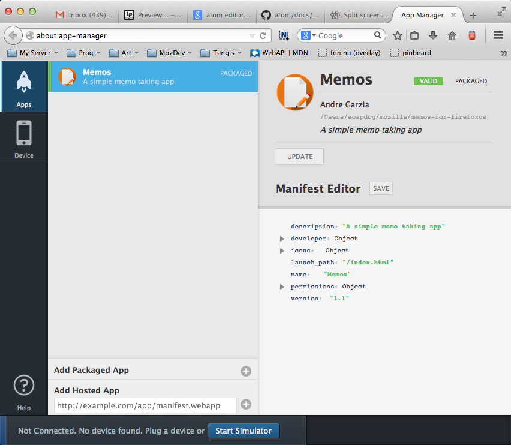
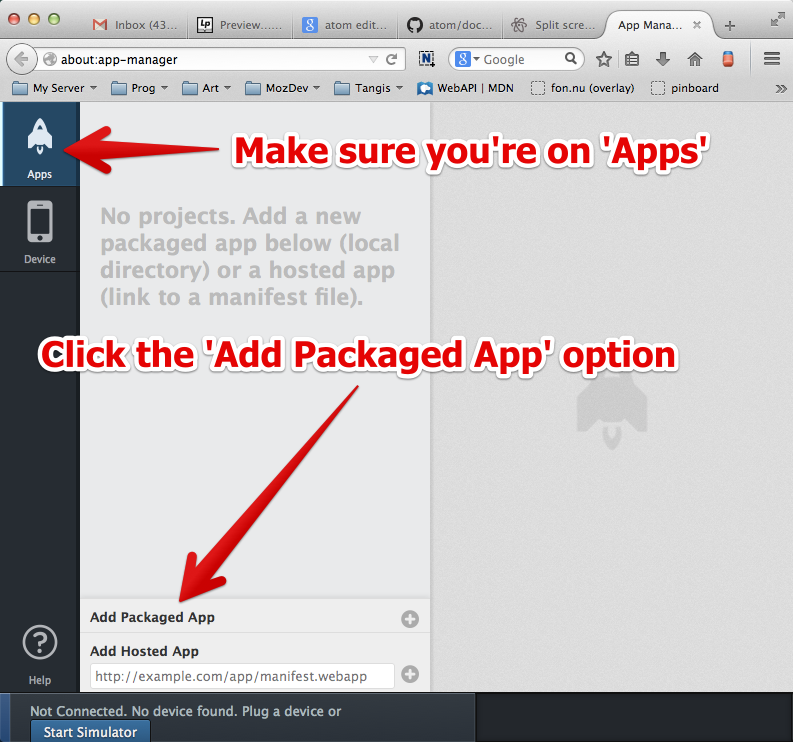
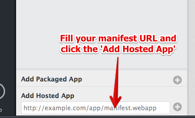
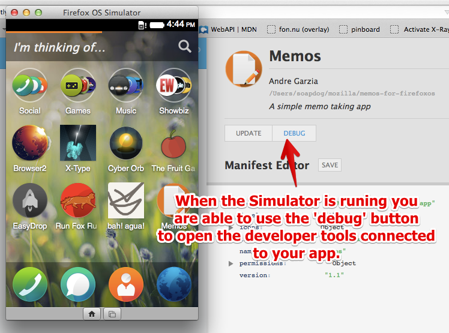
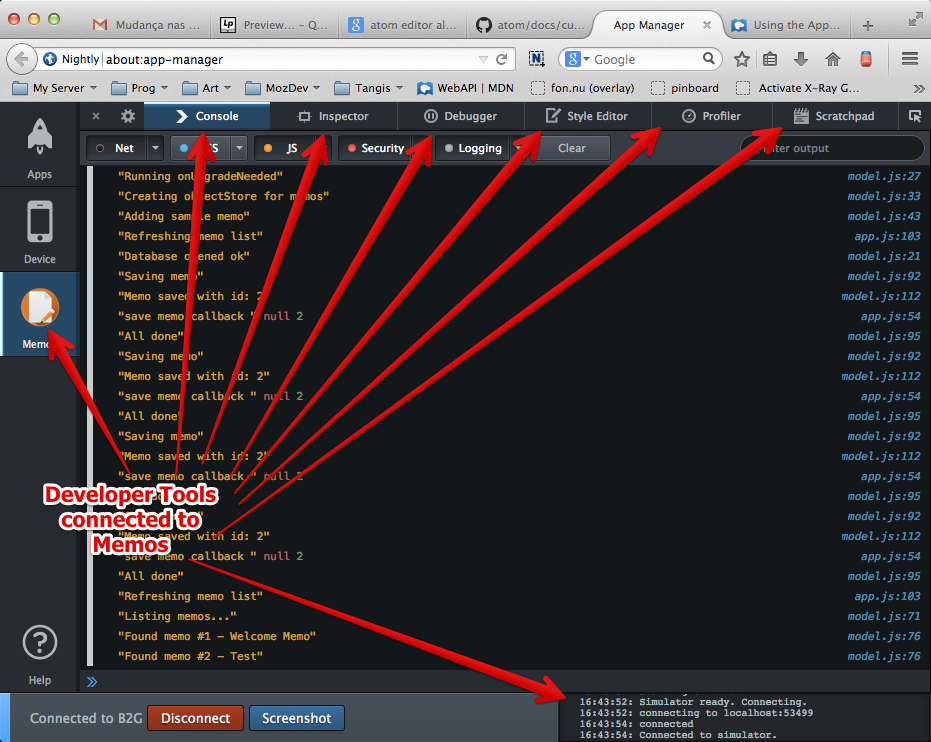
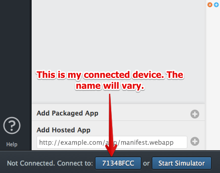

# The App Manager {#app-manager}

We've setup the Simulator in [the chapter about preparing the environment](#setup) and we used it on the [chapter about building our first app](#firstapp). Now we're going to take a deeper look into the App Manager features and learn how to do the most common tasks.

To learn more about it, check out [the Firefox OS: Using the App Manager page](https://developer.mozilla.org/docs/Mozilla/Firefox_OS/Using_the_App_Manager) on MDN.

W> Remember: that if you are using a device running Firefox OS 1.1 or older then you need to use the Firefox OS 1.1 Simulator extension with it and not the App Manager. This Simulator is explained in the next chapter.

## Adding Apps

You can add both hosted and packaged apps to the App Manager. Lets see how to add each type of app:

### Adding packaged apps

You already saw how to add packaged apps to the App Manager during [our first app creation](#firstapp), but we're going to do a recap so I can show you what else is possible.

To add a new packaged application click the **Add Packaged App** button on the **App Manager Dashboard** as shown in the screenshot below.

When you click on the button highlighted on the image, Firefox opens a file selection dialog. You should browse your hard drive and select the **folder that contains the manifest file** for the application that you want to add to the App Manager. If there are no issues with your manifest then your app will be addes to the list on screen.

### Adding hosted apps

If you're building a hosted app then you should test it by using a web server. Do not try to use the method described above for hosted apps because you may miss some errors that will only happen on a hosted environment - such as serving the manifest with the wrong *MIME type*. Note that the simulator won't warn you about things like incorrect MIME types, but it's important to get such things right if you submit your app to the Mozilla Marketplace.

Most of the hosted apps are not applications built exclusively for Firefox OS but responsive design based websites that are able to adapt themselves to different devices and resolutions. These web apps usually have a complex backend that needs to be in-place for the application to work and that's why you need to test the app using a real web server running your backend stuff.

To run your app in the simulator, fill the URL of your application in the text entry box and click the **Add Hosted App** button.

After clicking the button, the manifest is verified and if it is correct the application will be added and the App Manager.

## Running your app

To run your application click the **Start Simulator** button. After that you will be able to select which of the installed Simulator you want to run.

Once you have a Simulator running you can click the **Update** button inside your application listing and it will install the app on the running Simulator.

The application icon will appear at the home screen of the Simulator once the installation is complete. You can just click it to run.

## Updating your app

Every time you change some of your files and want to test again on the Simulator you need to press the **Update** button to update the installation of your app on the running Simulator.

## Debugging

After the application is added to a running Simulator we're able to debug it by clicking the **Debug** button in the application listing. This will launch the your app on the running Simulator and open a **JavaScript Console** connected to your app.

After pressing this button you will see a screen like this:

With the tools connected to your app you can test your JavaScript, debug your DOM, edit styles, etc. Like those startup guys like to say: *pivot until your app is good*.

Once your app is running well on the simulator it's time to test on a real device.

## Testing apps on a real device

Nothing replaces testing on a real device. On the simulator, you test things by using a mouse and clicking on a computer screen; while on a real device you use your fingers on a touchscreen and by using physical buttons. Its a very different user and development experience.

As an example why this type of testing matters, let me tell you a brief story: Some years ago, Raphael Eckhardt (the designer who created the cover of this book) and I were building a puzzle game not that disimilar to Bejeweled. Our game involved dragging and dropping some pieces on a board and was working pretty well on the simulator.

When we then tested the game on an actual phone we realized our game components were not touch friendly at all. When placing a hand over the screen the board would vanish behind the hand. Even worst, the pieces the users were supposed to drag were smaller than the user's finger tip, so the user couldn't see what they were doing! In summary, our UX sucked very badly. That happened because we kept trying things only on the simulator using a mouse that had a tiny cursor. When we decided to try with our fatter-than-a-cursor fingers we realized that we need to rework our UI.

To avoid having a similarly frustrating experience, always test on a real device... or two, or more if you can get your hands on multiple devices. Test often with simple prototypes. Otherwise, you can waste valuable time and money having to recreate assets.

## Connecting with a Firefox OS device

If you have a Firefox OS device (and have any needed drivers installed) then you can push apps directly from the App Manager to the device if the device is connected to your computer. When the App Manager detects that you plugged a Firefox OS phone, it will display the id of the phone on the bottom next to the **Start Simulator** button.

If you press that button. The phone will ask for permission to establish a debugging connection with the App Manager, you need to grant that. Once that connection is made you will be able to use the **Update** and **Debug** buttons on your app listing to install and debug your application on the connected device just like you did with the running Simulator.

## Summary

In summary, the App Manager is fantastic. Its much better than the old Firefox OS 1.1 Simulator Extension since it has better developer tools and can run multiple Firefox OS versions. We can envision the App Manager getting better and better with its built-in manifest editor and more.

Besides feeling awesome and empowered, by this point in the book you hopefully have a good grasp of the workflow for building apps for Firefox OS.

In the next chapter we'll talk about the old Firefox OS 1.1 Simulator Extension. This is the only way to connect to devices running Firefox OS 1.1. The chapter is really similar to this one. Actually its the same content but adapted for the different UI.

After the Simulator chapter, we'll talk about distributing your application.
