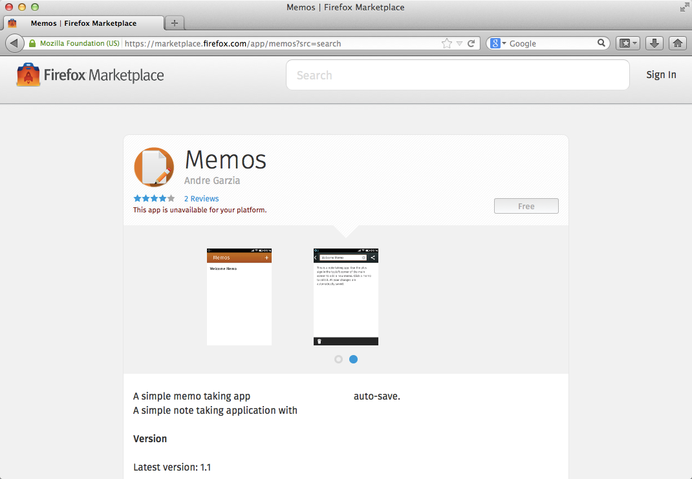
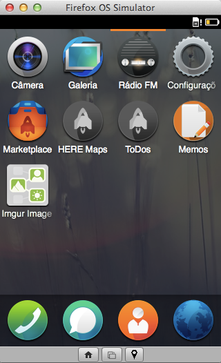
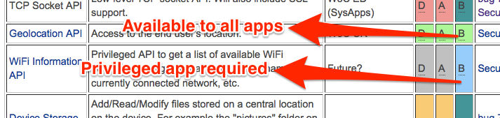
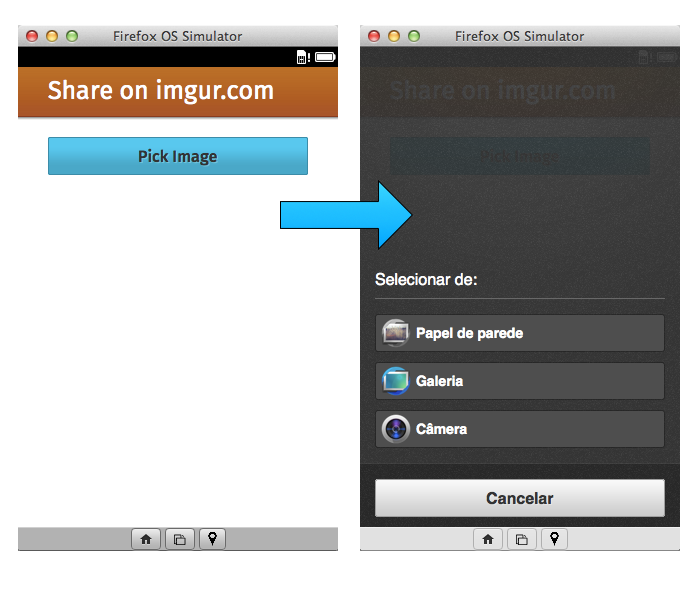

# Basic Concepts {#concepts}

Before we get our hands dirty and build our first app, let's learn some basic concepts about developing for Firefox OS. We learned in the [introduction](#introduction) that, just like web pages, apps in Firefox OS are based on HTML5. However, we haven't explained what makes Firefox OS apps different from regular web pages. 

If we use our collective knowledge about other mobile platforms we can see that native application generally will have:

* A name and an icon that the user can press to launch the app.
* Access to system services and hardware capabilities. 

Looking at the big picture, a Firefox OS app is just a web page that has an icon, a name and is usually able to work offline (depending on how the app is implemented). All the data about an application such as name, icon and more is defined in a *application manifest file* that is the focus of our next section.

## The Application Manifest

The [manifest](https://developer.mozilla.org/docs/Apps/Manifest) is a [JSON](http://json.org) file that describes aspects of an hosted web app. Usually this file is called **manifest.webapp** and lives next to your main HTML file that is usually called **index.html**.

<<[Sample Manifest](code/sample_manifest.webapp)

Above we can see the manifest for an application called memos[^memos]. Among other things it describes who created the application, which icons are used, what is the name of the app, what file is used to launch the app (in this case it is *index.html*), what hardware access permissions your app requires, etc. This file is used by Firefox OS to add the application to the device's home screen and by the Firefox Marketplace to display the application on the catalog as we can see in the image below.

[^memos]: This is a sample app for Firefox OS as [seen on the Firefox Marketplace](https://marketplace.firefox.com/app/memos) for which the [source code is on GitHub](https://github.com/soapdog/memos-for-firefoxos).

Note how the information from the manifest is used by the system to add the app to the homescreen, as we can see on the following screenshot.

By gathering your HTML, CSS, JavaScript, and a manifest file you already have an application ready to run on Firefox OS. Moving on our topic about basic concepts let's learn more about what application types there are.

## Types of Application

Firefox OS currently has two types of applications: hosted apps and packaged apps - though more types may become available in the future (e.g. custom keyboards and the ability to create other system services).

* **Hosted Apps:** Are hosted on a web server just like normal websites. This means that when the user launches a hosted app, its content is loaded from the remote server (or from the cache, if available).
* **Packaged Apps:** Are distributed as a zip file and copied to the device when installed. When the user launches a packaged app, its contents are loaded from the zip file instead of a remote server. 

There are pros and cons to both types. On the one hand, hosted apps are easier to maintain, as all you need to do is maintain files on your web server. However, it's harder to make them work offline because it requires the use of the much despised [**appcache**](https://developer.mozilla.org/pt-BR/docs/HTML/Using_the_application_cache). Hosted apps are also limited in which WebAPIs they can use, which means they can't do all the things a packaged app can do.   

On the other hand, packaged apps have all their content stored on the device - which means they are always available when the user is offline (and so avoid needing appcache). They also have the ability to access security-sensitive WebAPIs that are not available to hosted apps. Updating them can be a bit painful, because you need to upload any new version to the Firefox Marketplace - which means going through a review process, which can take some time.   

When trying to choose which type of application to build, consider: if you require advanced WebAPIs, then you should use a packaged app. However, if your application works fine without needing to access any advanced system services or device capabilities beyond those already available in a web browser, then always choose a hosted app. It is ok to use packaged apps if you don't have a place to host it.

Above I mentioned that appcache can be problematic (which is sometimes required for hosted apps). Don't worry too much as there are tools available to make appcache generation and deployment easier [^js-tools].

In this book we're going to build packaged apps, as it will allow us to explore what is possible with the WebAPIs. However, most of what we will learn about manifests applies to hosted apps. If you want to know more about distributing hosted apps, check [the hosted applications link at the developer hub](https://marketplace.firefox.com/developers/docs/hosted).

[^js-tools]: There are many useful tools out there, check out [Gulp](https://github.com/gulpjs/gulp), [Grunt](http://gruntjs.com), [Volo](http://volojs.org/), [Yeoman](http://yeoman.io/), [Bower](http://bower.io/). There is a lot of overlap among these tools, its a matter of preference which one you use. (I like Volo more than Grunt mostly because Volofiles are easier for me to read).

Now that we've covered the two types of applications that Firefox OS supports, let's look at the different levels of system access they can have.

## Security Access Levels

There are three security levels on Firefox OS - with each level having more access to APIs than the previous level.

* **Plain (a.k.a. web):** This is the default level for all applications. This level applies to hosted apps and packaged apps that do not declare a `type` property in their manifest file. These apps have access to the common set of APIs found in browsers - but don't have access to any of Mozilla's WebAPIs.
* **Privileged:** This type of app has access to all common APIs found in the Firefox browser, plus some additional ones, such as contacts, and system alarms. Only **packaged apps can be privileged apps** and the package must be digitally signed by the Firefox OS Marketplace.
* **Certified:** For security reasons, this level is only available to Mozilla and its partners (e.g. phone manufacturers, telecoms, etc.). Certified apps are able to access all the APIs, such as telephony and more. An example of certified app is the Firefox OS dialer application. 

During development, it is possible for us to access privileged APIs without needing any special permission from Mozilla. But when we want to distribute a privileged app, it first needs to go to the Firefox Marketplace. There, the code is checked as part of a rigorous approval process, and if it's found to be OK, it will be digitally signed - which tells users of Firefox OS that this application is allowed to access sensitive APIs.

On [the page about the WebAPIs on the Mozilla Developer Network](https://developer.mozilla.org/en-US/docs/WebAPI) we can see what APIs are implemented on what platforms and what access level is needed to use each API.

As we can see on the image above, any application can access the *IndexedDB API and FileHandle API* but only privileged apps can access the *Contacts API and Device Storage API*.

## Mozilla's WebAPIs

Firefox OS provides us with the APIs that enable us to build applications that are just as capable as native apps on other platforms. Access to hardware and services is done through the WebAPIs. To learn more about the list of available APIs for the current Firefox OS version check out [the WebAPI page on the Mozilla Wiki](https://wiki.mozilla.org/WebAPI).

Lets review some code examples to see how easy those APIs are to use. Don't take this example as a full documentation of the WebAPIs, they are just a small sample to make you understand how we can access device features using JavaScript.

### Example #1: Making calls

Imagine that you have an application that needs to open the dialer with a phone number already filled in. You can just use the following code:

<<[Sending a phone number to the dialer](code/webapi_samples/dial.js)

This code makes a request to the dialer app to call a particular number. Note that this doesn't actually place a call - the user will still need to tap the dial button to place the call. Requiring explicit user action before executing some other action is pretty common: it's a good security pattern because it requires user interaction through consent before allowing something to happen. Other APIs that can place calls without user interaction are available for more elevated access levels. Certified apps can place calls without interaction for example. The API used in the code above, called "Web Activities", is available to all apps though.

Check out the the Mozilla Blog for [more information about Web Activites](https://hacks.mozilla.org/2013/01/introducing-web-activities/). 

### Example #2: Saving a contact

Imagine that you have a company intranet and you want to provide a way to transfer a contact from the online intranet address book to the phone address book. You can do that with the Contacts API.

<<[Saving a contact](code/webapi_samples/contact.js)

This API creates an object with the contact data and saves it into the phone address book without requiring user interaction. Because access to contacts carries potential privacy implications, this API is only available for *privileged apps*. This pattern where you create an object with a success and an error callback is used in many of the WebAPIs.

To learn more about this API, read [the page about the *Contacts API* on the Mozilla Wiki](https://wiki.mozilla.org/WebAPI/ContactsAPI).

### Example #3: Picking an image from the camera

Imagine you are building an application that applies fancy filters to pictures. You want to place a button in your app that allows the user to pick a photo from a photo album or from the camera.

<<[Picking an image](code/webapi_samples/pick.js)

Here we see another example of a [WebActivity](https://hacks.mozilla.org/2013/01/introducing-web-activities/). These activities are available to all applications. In this specific sample we're using the *pick* activity and passing in the *MIME Types* of the files that we wish to retrieve. When this code is executed, the system shows a screen to the user asking where he or she wants to retrieve the image from (camera, gallery, wallpapers). If the user selects an image, the success callback is triggered. If the user cancels the operation, the error callback is executed. On the image below, we can see the dialog that lets the user pick a photo from the device:

## Summary

In this chapter we saw that, unlike regular web pages, both Firefox OS' hosted apps and packaged apps rely on a manifest file. We also saw that, from a security perspective, packaged apps can be "privileged" or "certified". Only privileged and certified apps can access Mozilla's powerful set of WebAPIs. The more sensitive WebAPIs are not available to hosted apps or to regular web pages. 

Now it's about time we get our hands dirty and create an app!
