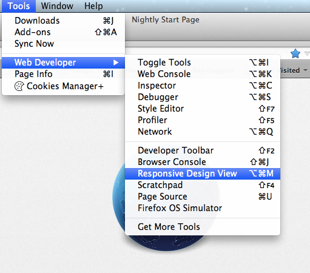
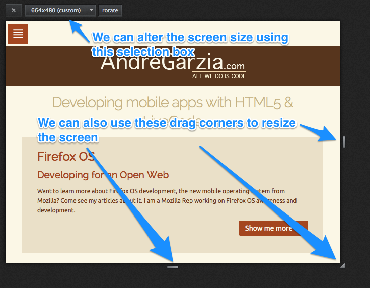

# Developer Tools {#developertools}

Firefox has many tools to help web developers do their job. Many people are still using [FireBug](https://addons.mozilla.org/pt-BR/firefox/addon/firebug/) and haven't realize that Firefox now has its own built-in tools. In this chapter we're going to review the tools that are most useful for developing apps for Firefox OS.

If you're interested in learning more about these tools, and what other dev tools goodness is about to land in Firefox, check out the [developer tools](https://developer.mozilla.org/en-US/docs/Tools) page on Mozilla's Developer Network (really, go check that link! I will wait).
 
## Introducing the Responsive Design View

A common workflow in Web development is changing a HTML file and then reloading the page in the browser to see what's changed. Unless you are using something like Grunt or Volo, generally there won't be the need for a compilation step or similar. Even though the Firefox OS Simulator permits you to use that same workflow, the emulator is currently restricted to one resolution (480x320). This is less than ideal if you are also designing your application to work on tablets, phablets, giant TVs, or anything in between.  

To check how your app will look on any screen resolution, you can use Firefox's **Responsive Design View** tool to change the screen (and viewport). It can be enabled by going to the **Tools menu -> Web Developer -> Responsive Design View** as shown in the image below. When you activate this tool, the window will change so that you can alter the viewport size using the drag corners or the selection box.

Using the responsive design view is specially useful for testing out [**media queries**](https://developer.mozilla.org/en-US/docs/Web/Guide/CSS/Media_queries), as it allows you to resize the screen and see how your site responds to changes in layout in real time. Another great feature of the Responsive Design View is that you can save predefined sizes. If you know what viewport sizes you are targetting, then your can quickly check different viewport sizes without needing to resize the actual browser window. 

At the time of writing, most of the Firefox OS phones that are on the market are running on a 480x320 resolution - and at a pixel density of about 96 pixels-per-inch. However, you should expect this to change as new Firefox OS hardware becomes available as time goes on: screens will likely pack more pixels and have higher pixel densities (just like Apple's retina displays). 

To future proof your app, don't hard-code your CSS to any resolution or pixel density. Instead, you should use media queries and the responsive design methodology to create apps that adapt to any screen size. To learn more about responsive design, I recommend the following books [Responsive Web Design](http://www.abookapart.com/products/responsive-web-design) and [Mobile First](http://www.abookapart.com/products/mobile-first).

In summary, the responsive design view allows us to test our web applications using many different screen sizes without the need to resize the Firefox browser window itself. In my humble opinion this is one of the most useful web developer tools available - but it has one big limitation: it does not currently allow you to test different pixel densities (i.e. to see what your site would look like on a "retina" display or better).

## Developer tools

Firefox's developer tools are similar to FireBug and the tools available in other modern browsers. Using these tools you can execute and debug your JavaScript using [the console](https://developer.mozilla.org/en-US/docs/Web/API/console), and manipulate both the DOM and the CSS on the current page.  

To bring up the console, you can either:

	* Go to "Tools menu > Web Developer > Web Console". 
  * right-click on the page you want to debug, and select "Inspect Element", then click on "Console" tab. 

 

Besides the *JavaScript Console* there are many other tools available such as [*the style editor*](https://developer.mozilla.org/en-US/docs/Tools/Style_Editor), [*the network monitor*](https://developer.mozilla.org/en-US/docs/Tools/Network_Monitor), [*the JavaScript profiler*](https://developer.mozilla.org/en-US/docs/Tools/Profiler), [*the JavaScript debugger*](https://developer.mozilla.org/en-US/docs/Tools/Debugger), [*the page inspector*](https://developer.mozilla.org/en-US/docs/Tools/Page_Inspector) and many others.

In the application we've built in the previous chapter, we used the console to check the progress of our application. This is a pretty powerful way to debug our apps - but some developers are still  using `alert()` all over their JavaScript code as their "debug tool". 

Using `alert()` is really bad because if one forgets to remove any `alert()`s, it's the user's who will ultimately pay the price. Using the console avoids this problem as it harmlessly (and silently!) routes all messages to a place that user's don't normally access - so it doesn't disrupt the user experience. Using the console also means you don't need to remove your console messages from your code, unless you really want to. This can help with code maintenance and debugging if things do go wrong (as they generally do with any software!).   

Learning how to properly use the developer tools bundled with Firefox (or whatever browser you're using) is an important step in becoming a better developer. That's why I advise everyone to check the links above and get more familiar with the various tools available in Firefox. 

One special tool that was not mentioned above is the [*remote debugger*](https://developer.mozilla.org/en-US/docs/Tools/Remote_Debugging). That tool allows us to connect to a phone running Android or Firefox OS, and use the developer tools to debug the code that is running on the device in real time. 

## Summary

This chapter provided a brief tour of the developer tools that come bundled with Firefox. Using these tools will make your development process easier, specially when you use them together with the Firefox OS simulator. They are an indispensable combination for putting together an application. In the next chapter we're going to learn more about the simulator and how to make the best use of it.
