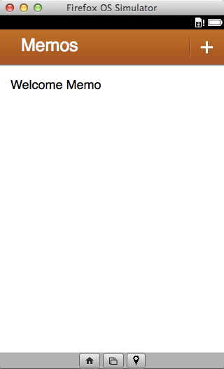
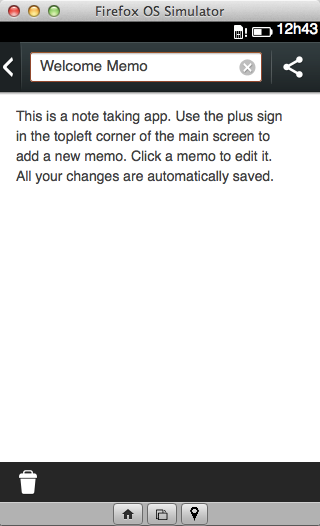
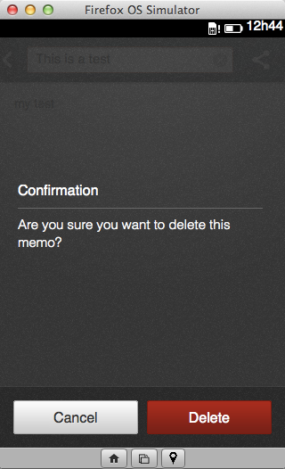
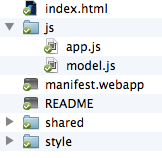
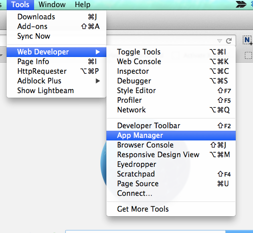
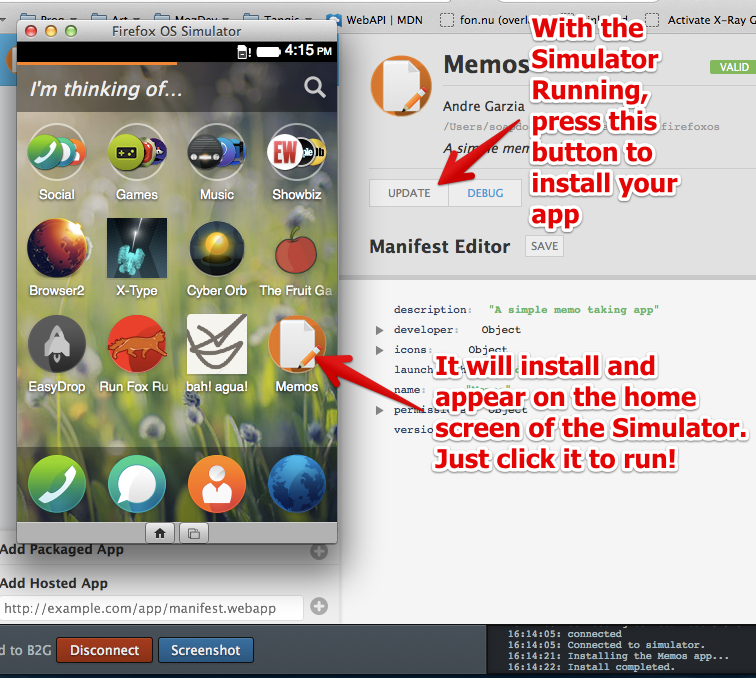
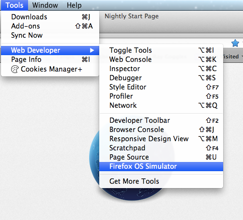
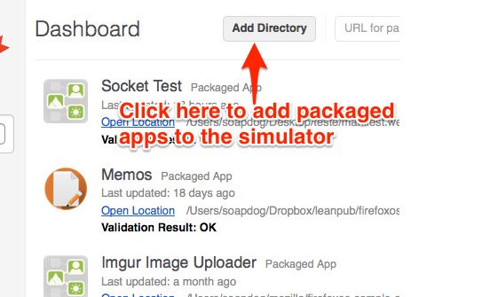
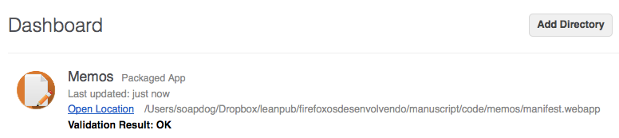

# Our First App {#firstapp}

In this chapter we're going to build a simple **Memos** application, which is an application for taking notes. Before coding, let's review how this app works.

The app has three screens. The first one is the main screen and has a list of your stored notes by title. When you click a note (or add a new one) you're moved to the detail screen that allows you to edit the content and title of the given note. This is shown in the figure below.

On the screen shown above the user can choose to delete the selected note by clicking on the trash icon. This will cause a confirmation dialog to be shown.

The source code for Memos is available at [the Memos Github Repo](https://github.com/soapdog/memos-for-firefoxos) (also available as a [.zip](https://github.com/soapdog/memos-for-firefoxos/archive/master.zip) file). I recommend you download the files, so it's easier to follow along. Another copy of the source code is available on the **code** folder inside the [github repository for this book](https://github.com/soapdog/firefoxos-quick-guide).

Memos uses [IndexedDB](https://developer.mozilla.org/en-US/docs/IndexedDB/Using_IndexedDB) to store the notes and the [Gaia Building Blocks](http://buildingfirefoxos.com/building-blocks) to build the interface. In a future update to this book I will talk more about the Gaia Building Blocks, but at the moment I am just going to use them. You can check the link above to learn more about them and what user interface tools they provide.

The first step is to create a folder for the application, let's call this folder **memos**.

## Creating the app manifest

Memos manifest is pretty straight forward. Create a file named **manifest.webapp** on the **memos** folder. Manifests are [JSON](http://json.org) files that describes an application. In this file we place things such as the name of the app, who the developer is, what icons are used, what file is used to launch the app, what privileged APIs it would like to use, and more.

Below we can see the contents of the Memos app manifest. Attention when copying this data because it's very easy to place a comma on the wrong place and create an invalid JSON. There are many tools that you can use to validate JSON files but there is a special one that is built specifically for validating app manifests. You can check out this online tool at [http://appmanifest.org/](http://appmanifest.org/). To learn more about app manifests read [this page on MDN about them](https://developer.mozilla.org/docs/Apps/Manifest).

<<[Memos manifest file (*manifest.webapp*)](code/memos/manifest.webapp)

Let's review the fields from the manifest above.

|Field		|Description                                                                        |
|-----------|-----------------------------------------------------------------------------------|
|name		|This is the name of the application.		                                                |
|version	|This is the current version of the app. 										    |
|launch_path|What file is used to launch your application.					                    |
|permissions|What API permissions your app requests. More information about this below.				|
|developer  |Who developed this application 													|
|icons		|The icons used by the app in many different sizes.									|

The most interesting part of this manifest is the permissions field where we ask for the *storage* permission that allows us to use IndexedDB without size restrictions[^storage-permission] (thanks to that permission we can store as many notes as we want - though we should be mindful not to use too much of the user's disk space!).

[^storage-permission]: To learn more about permissions read [the page on MDN about app permissions](https://developer.mozilla.org/en-US/docs/Web/Apps/App_permissions).

Now that the manifest is ready let's move on to the HTML.

## Building the HTML

Before we start working on the HTML, let's take a brief detour to talk quickly about the [Gaia Building Blocks](http://buildingfirefoxos.com/building-blocks), which are a collection of reusable CSS and JS with the *look and feel* of Firefox OS that we can use on our own apps.

Just like on the Web, you're not required to use the *look and feel* of Firefox OS in your own app. Using or not using the Gaia Building Blocks is a personal decision - and a good applications should have its own distinctive style and user experience. The important thing to understand is that your app will not suffer any type of prejudice or penalty on the Firefox Marketplace by not using the Gaia look and feel. I am using it here because I am not a good designer so ready made UI toolkits appeal to me (it's either that or hiring a designer).

The HTML structure that we use in this application was built following the patterns adopted by the Gaia Building Blocks where each screen is a `<section>` and the elements follow a predefined format. If you haven't already, download the source code from the [memos repository](https://github.com/soapdog/memos-for-firefoxos) so that you have the files (including the Building Blocks) to use. For those not confident with git and GitHub, the files are also available as a [.zip file](https://github.com/soapdog/memos-for-firefoxos/archive/master.zip).

W> Warning: The version of the Gaia Building Blocks I used for this app is not the most up-to-date available from Mozilla. Trying to update to the current version will, unfortunately, break the Memos app. In your own projects, however, always use the latest version of the Gaia Building Blocks.

### Including the Building Blocks

Before doing anything else copy the **shared** and the **styles** folders that you obtained by downloading the Memos repository to the **memos** folder you created. This will allow use to use the Gaia Building Blocks in our app.

Let's begin our **index.html** files by including the needed bits.

~~~~~~~~
<!DOCTYPE html>
<html>
<head>
    <meta charset="utf-8">
    <link rel="stylesheet" type="text/css" href="style/base.css" />
    <link rel="stylesheet" type="text/css" href="style/ui.css" />
    <link rel="stylesheet" type="text/css" href="style/building_blocks.css" />
    <link rel="stylesheet" type="text/css"
          href="shared/style/headers.css" />
    <link rel="stylesheet" type="text/css"
          href="shared/style_unstable/lists.css" />
    <link rel="stylesheet" type="text/css"
          href="shared/style_unstable/toolbars.css" />
    <link rel="stylesheet" type="text/css"
          href="shared/style/input_areas.css" />
    <link rel="stylesheet" type="text/css"
          href="shared/style/confirm.css" />
    <title>Memos</title>
</head>
~~~~~~~~

On *line 01* we declare the DOCTYPE as HTML5. From *line 05 up to 15* we include the CSS from the various components that we're going to use in our app such as headers, lists, text entry fields and more.

### Building the main screen

Now we can start building the various screens. As mentioned earlier, each screen used by our app is a `<section>` inside the HTML `<body>`. The body tag must have an attribute *role* with its value equal to *application* because that is used by the CSS selectors to build the interface, so our body tag will be `<body role="application">`. Let's build the first screen and declare our body tag as well.

~~~~~~~~
<body role="application">

<section role="region" id="memo-list">
    <header>
        <menu type="toolbar">
            <a id="new-memo" href="#">add</a>
        </menu>
        <h1>Memos</h1>
    </header>
    <article id="memoList" data-type="list"></article>
</section>
~~~~~~~~

Our screen has a `<header>` containing a button to add new notes and the application name. The screen also has an `<article>` which will be used to hold the list of stored notes. We're going to use the button and the article IDs to capture events when we reach the JavaScript implementation part.

Be aware that each screen is a fairly straight forward HTML chunk. Building these same screens in many languages usually requires a lot more work. All we're doing is declaring our containers and giving them IDs when we need to reference them later.

Now that the main screen is done, let's build the editing screen.

### Building the editing screen

The editing screen is a bit more complex because it also holds the dialog box used when the user tries to delete a note.

~~~~~~~~
<section role="region" id="memo-detail" class="skin-dark hidden">
    <header>
        <button id="back-to-list">back
        </button>
        <menu type="toolbar">
            <a id="share-memo" href="#">share
            </a>
        </menu>
        <form action="#">
            <input id="memo-title" placeholder="Memo Title" required="required"
	           type="text">
            <button type="reset">Remove text</button>
        </form>
    </header>
    

        <textarea placeholder="Memo content" id="memo-content"></textarea>
    

    

        <ul>
            <li>
                <button id="delete-memo" class="icon-delete">Delete</button>
            </li>
        </ul>
    

    <form id="delete-memo-dialog" role="dialog" data-type="confirm"
          class="hidden">
        <section>
            <h1>Confirmation</h1>
            
Are you sure you want to delete this memo?

        </section>
        <menu>
            <button id="cancel-delete-action">Cancel</button>
            <button id="confirm-delete-action" class="danger">Delete</button>
        </menu>
    </form>
</section>
~~~~~~~~

At the top of the screen, represented by the `<header>` element, we have:

 * a back button to return to the main screen,
 * a text entry field that is used to hold the title of the given note,
 * and a button that is used to share the note over email.

Below the top toolbar, we have a paragraph holding a `<textarea>` that holds the content of the note and then another toolbar with a trashcan button used to delete the current viewed note.

These three elements and their child nodes are the editing screen. After them we have a `<form>` that is used as a dialog box containing the confirmation screen that is presented to the user when he or she tries to delete a note. This dialog box is pretty simple, it only contains the text of the confirmation prompt and two buttons; one for deleting the note and another for canceling the action.

Now that we're closing this `<section>` we have all our screens implemented and the remaining HTML code is only there to include the JavaScript files and close the html file.

~~~~~~~~

</body>
</html>
~~~~~~~~

## Crafting the JavaScript code

Now we're going to breathe life into our app by adding JavaScript. To better organize this code, I've divided the JavaScript code into two files:

* **model.js:** contains the routines to deal with storage and retrieval of notes but does not contain any app logic or anything related to the interface or data entry. In theory, we could reuse this same file in other apps that required text notes.
* **app.js:** attaches the HTML elements with their event handlers and contains the app logic.

Both files should be placed inside a **js** folder next to the **style** and **shared** folders.

### model.js

We're going to use [IndexedDB](https://developer.mozilla.org/en-US/docs/IndexedDB/Using_IndexedDB) to store our notes. Since we asked the *storage* permission on the app manifest we can store as many notes as we want - however, we should not abuse this! Firefox OS devices generally have very limited storage space, so you always need to be mindful of what data you store (users will delete and down-rate your app if it uses too much storage space!). And storing excessive amounts of data will have a performance penalty, which will make your app feel sluggish. Please also note that when you submit an application to the Firefox OS Marketplace, reviewers will ask you why you need unlimited storage space - if you can't justify why, your application will be rejected.  

The part of the code from *model.js* that is shown below is responsible for opening the connection and creating the storage.

A> Important: This code was written to be understood easily and does not represent the best practices for JS programming. Some global variables are used (I'm so going to hell for this) among other tidbits. The error handling code is basically non-existant. The main objective of this book is to teach the *workflow* of developing apps for Firefox OS and not teaching best JS patterns. That being said, depending on feedback, I will update the code in this book to better reflect best practices if enough people think it will not impact the beginners.

~~~~~~~
var dbName = "memos";
var dbVersion = 1;

var db;
var request = indexedDB.open(dbName, dbVersion);

request.onerror = function (event) {
    console.error("Can't open indexedDB!!!", event);
};
request.onsuccess = function (event) {
    console.log("Database opened ok");
    db = event.target.result;
};

request.onupgradeneeded = function (event) {

    console.log("Running onUpgradeNeeded");

    db = event.target.result;

    if (!db.objectStoreNames.contains("memos")) {

        console.log("Creating objectStore for memos");

        var objectStore = db.createObjectStore("memos", {
            keyPath: "id",
            autoIncrement: true
        });
        objectStore.createIndex("title", "title", {
            unique: false
        });

        console.log("Adding sample memo");
        var sampleMemo1 = new Memo();
        sampleMemo1.title = "Welcome Memo";
        sampleMemo1.content = "This is a note taking app. Use the plus sign " +
	                      "in the topleft corner of the main screen to " +
			      "add a new memo. Click a memo to edit it. All " +
			      "your changes are automatically saved.";

        objectStore.add(sampleMemo1);
    }
}
~~~~~~~

A> Important: Forgive me again for the globals, this is an educational resource only. Another detail is that I removed the comments from the source code to save space in the book. If you pick the source from GitHub you will get all the comments.

The code above creates a *db* object and a *request* object. The *db* object is used by other functions in the source to manipulate the notes storage.

On the implementation of the `request.onupgradeneeded` function we also create a welcome note. This function is executed when the application runs for the first time (or when the database version changes). This way once the application launches for the first time, the database is initialized with a single welcome note.

With our connection open and the storage initialized its time to implement the basic functions for note manipulation.

~~~~~~~~
function Memo() {
    this.title = "Untitled Memo";
    this.content = "";
    this.created = Date.now();
    this.modified = Date.now();
}

function listAllMemoTitles(inCallback) {
    var objectStore = db.transaction("memos").objectStore("memos");
    console.log("Listing memos...");

    objectStore.openCursor().onsuccess = function (event) {
        var cursor = event.target.result;
        if (cursor) {
            console.log("Found memo #" + cursor.value.id +
	                         " - " + cursor.value.title);
            inCallback(null, cursor.value);
            cursor.continue();
        }
    };
}

function saveMemo(inMemo, inCallback) {
    var transaction = db.transaction(["memos"], "readwrite");
    console.log("Saving memo");

    transaction.oncomplete = function (event) {
        console.log("All done");
    };

    transaction.onerror = function (event) {
        console.error("Error saving memo:", event);
        inCallback({
            error: event
        }, null);

    };

    var objectStore = transaction.objectStore("memos");

    inMemo.modified = Date.now();

    var request = objectStore.put(inMemo);
    request.onsuccess = function (event) {
        console.log("Memo saved with id: " + request.result);
        inCallback(null, request.result);

    };
}

function deleteMemo(inId, inCallback) {
    console.log("Deleting memo...");
    var request = db.transaction(["memos"],
                  "readwrite").objectStore("memos").delete(inId);

    request.onsuccess = function (event) {
        console.log("Memo deleted!");
        inCallback();
    };
}
~~~~~~~~

On the piece of code above we create a constructor function that creates new Memos with some fields already initialized. After that we implement functions for listing, saving and removing notes. Many of these functions receive a callback parameter called `inCallback` which is a function to be called after the function does its thing. This is needed due to the asynchronous nature of IndexedDB. All callbacks have the same signature which is `callback(error, value)` where one of the values is null depending on the outcome of the previous function.

A> Since this is a beginner book I've opted not to use [*Promises*](https://developer.mozilla.org/en-US/docs/Mozilla/JavaScript_code_modules/Promise.jsm/Promise) since many beginners are not familiar with the concept. I recommend using such concepts to create easier to maintain code that is more pleasant to read.

Now that our note storage and manipulation functions are ready, let's implement our app logic in a file called **app.js**.

### app.js

This file will contain our app logic. Since the source code is too large for me to place it all at once on the book, I will break it in parts and explain each part piece by piece.

~~~~~~~~
var listView, detailView, currentMemo, deleteMemoDialog;

function showMemoDetail(inMemo) {
    currentMemo = inMemo;
    displayMemo();
    listView.classList.add("hidden");
    detailView.classList.remove("hidden");
}

function displayMemo() {
    document.getElementById("memo-title").value = currentMemo.title;
    document.getElementById("memo-content").value = currentMemo.content;
}

function shareMemo() {
    var shareActivity = new MozActivity({
        name: "new",
        data: {
            type: "mail",
            body: currentMemo.content,
            url: "mailto:?body=" + encodeURIComponent(currentMemo.content) +
	                "&subject=" + encodeURIComponent(currentMemo.title)

        }
    });
    shareActivity.onerror = function (e) {
        console.log("can't share memo", e);
    };
}

function textChanged(e) {
    currentMemo.title = document.getElementById("memo-title").value;
    currentMemo.content = document.getElementById("memo-content").value;
    saveMemo(currentMemo, function (err, succ) {
        console.log("save memo callback ", err, succ);
        if (!err) {
            currentMemo.id = succ;
        }
    });
}

function newMemo() {
    var theMemo = new Memo();
    showMemoDetail(theMemo);
}
~~~~~~~~

At the beginning we declare some global variables (yuck!!!) to hold references to some DOM elements that we want to use later inside some functions. The most interesting global is `currentMemo` which is an object that holds the current note that the user is reading.

The `showMemoDetail()` and `displayMemo()` functions work together. The first one loads the selected note into the `currentMemo` and manipulates the CSS of the elements so that the editing screen is shown. The second one picks the content from the `currentMemo` variable and places it on the screen. We could do both things on the same function but having them separate makes it easier to experiment with new implementations.

The `shareMemo()` function uses a [WebActivity](https://hacks.mozilla.org/2013/01/introducing-web-activities/) to open the email application with a new message pre-filled with the selected notes content.

The `textChanged()` function picks the data from the entry fields and place them into the `currentMemo` object and then saves the note. This is done because the application is an `auto-save` app where your content is always saved. All alterations on the content or title of the note will trigger this function and the note will always be saved on the IndexedDB storage.

The `newMemo()` function creates a new note and opens the editing screen with it.

~~~~~~~~
function requestDeleteConfirmation() {
    deleteMemoDialog.classList.remove("hidden");
}

function closeDeleteMemoDialog() {
    deleteMemoDialog.classList.add("hidden");
}

function deleteCurrentMemo() {
    closeDeleteMemoDialog();
    deleteMemo(currentMemo.id, function (err, succ) {
        console.log("callback from delete", err, succ);
        if (!err) {
            showMemoList();
        }
    });
}

function showMemoList() {
    currentMemo = null;
    refreshMemoList();
    listView.classList.remove("hidden");
    detailView.classList.add("hidden");
}
~~~~~~~~

The `requestDeleteConfirmation()` function is responsible for showing the note removal confirmation dialog.

The `closeDeleteMemoDialog()` and `deleteCurrentMemo()` are triggered by the buttons on the removal confirmation dialog.

The `showMemoList()` function does some clean up before showing the list of stored notes. For example, it cleans the content of `currentMemo` since we're not reading any memo yet.

~~~~~~~~
function refreshMemoList() {
    if (!db) {
        // HACK:
        // this condition may happen upon first time use when the
        // indexDB storage is under creation and refreshMemoList()
        // is called. Simply waiting for a bit longer before trying again
        // will make it work.
        console.warn("Database is not ready yet");
        setTimeout(refreshMemoList, 1000);
        return;
    }
    console.log("Refreshing memo list");

    var memoListContainer = document.getElementById("memoList");

    while (memoListContainer.hasChildNodes()) {
        memoListContainer.removeChild(memoListContainer.lastChild);
    }

    var memoList = document.createElement("ul");
    memoListContainer.appendChild(memoList);

    listAllMemoTitles(function (err, value) {
        var memoItem = document.createElement("li");
        var memoP = document.createElement("p");
        var memoTitle = document.createTextNode(value.title);

        memoItem.addEventListener("click", function (e) {
            console.log("clicked memo #" + value.id);
            showMemoDetail(value);

        });

        memoP.appendChild(memoTitle);
        memoItem.appendChild(memoP);
        memoList.appendChild(memoItem);

    });
}
~~~~~~~~

The `refreshMemoList()` function modifies the DOM by building element by element the list of notes that is displayed on the screen. It would be a lot easier to use some templating aid such as [handlebars](http://handlebarsjs.com/) or [underscore](http://underscorejs.org/) but since this app is built using nothing but *vanilla javascript* we're doing everything by hand. This function is called by `showMemoList()` that was shown above.

These are all the functions used by our app. The only part of the code that is missing is the initialization of the event handlers and the initial call of `refreshMemoList()`.

~~~~~~~
window.onload = function () {
    // elements that we're going to reuse in the code
    listView = document.getElementById("memo-list");
    detailView = document.getElementById("memo-detail");
    deleteMemoDialog = document.getElementById("delete-memo-dialog");

    // All the listeners for the interface buttons and for the input changes
    document.getElementById("back-to-list")
            .addEventListener("click", showMemoList);
    document.getElementById("new-memo")
            .addEventListener("click", newMemo);
    document.getElementById("share-memo")
            .addEventListener("click", shareMemo);
    document.getElementById("delete-memo")
            .addEventListener("click", requestDeleteConfirmation);
    document.getElementById("confirm-delete-action")
            .addEventListener("click", deleteCurrentMemo);
    document.getElementById("cancel-delete-action")
            .addEventListener("click", closeDeleteMemoDialog);
    document.getElementById("memo-content")
            .addEventListener("input", textChanged);
    document.getElementById("memo-title")
            .addEventListener("input", textChanged);

    // the entry point for the app is the following command
    refreshMemoList();

};
~~~~~~~

Now all files are ready and we can begin trying our application on the simulator. There are two ways of doing this depending if you're using the **App Manager** or the old **Firefox OS 1.1 simulator**. In the following section we'll show both. There will be specific chapters on each technology later.

If you're running **Firefox 29 or newer** then you have the **App Manager**, if you're running an older version then you can use the old simulator. Be aware that the App Manager is only able to connect to Firefox OS 1.2+ devices.

If you have a Firefox OS 1.1 device and you're running Firefox 29 then install the Firefox OS 1.1 simulator version 5.0 available for [Mac OS X](http://ftp.mozilla.org/pub/mozilla.org/labs/r2d2b2g/r2d2b2g-5.0pre7-mac.xpi), [Linux](http://ftp.mozilla.org/pub/mozilla.org/labs/r2d2b2g/r2d2b2g-5.0pre7-linux.xpi) or [Windows](http://ftp.mozilla.org/pub/mozilla.org/labs/r2d2b2g/r2d2b2g-5.0pre7-windows.xpi). If you install this simulator you will be able to follow the instructions for the old Firefox OS 1.1 simulator and be able to connect your device.

If your device running Firefox OS 1.1 is unlocked and able to receive version 1.2 or later then you should upgrade because it will make your life a lot easier. The Geeksphone Keon, Geeksphone Peak and Geeksphone Revolution have daily Firefox OS builds available at [http://downloads.geeksphone.com/](http://downloads.geeksphone.com/). The ZTE Open can also be upgraded following the instructions at [Upgrading your ZTE Open to Firefox 1.1 or 1.2 (fastboot enabled)](https://hacks.mozilla.org/2014/01/upgrading-your-zte-open-to-firefox-1-1-or-1-2-fastboot-enabled/). The LG Fireweb can't be upgraded, if you are like me and don't like this then go bug LG to open/upgrade their device on Twitter. The Alcatel One Touch Fire can be unlocked but this type of instruction is beyond this book.

W>Notice: This [bug request #1001590](https://bugzilla.mozilla.org/show_bug.cgi?id=1001590) on bugzilla will fix the current problem of not being able to run the Firefox OS 1.1 simulator on Firefox 29.

## Testing the app with the App Manager

Before we try our application on the simulator we'd better check out if the files are in the correct place. Your memos folder should look like this one:

If you have a hunch that you wrote something wrong, just compare your version with the one on [the memos github repository](https://github.com/soapdog/memos-for-firefoxos) (There is also a copy of the source code in a folder called **code** on the [book repository](https://github.com/soapdog/guia-rapido-firefox-os) ).

To open the *Simulator Dashboard* go to the menu for **Tools -> Web Developer -> App Manager**.

With the App Manager open, click the **Add Packaged App** option on the **Apps tab** and browse to where you placed the memos files and select that folder.

If everything works as expected you will see the Memos app on the list of apps.

After adding your application, click the **Start Simulator** button and run one of your installed simulators. If you haven't installed any simulator yet, I suggest you follow the instructions on screen and install them all.

With the Simulator running press the **Update** button on the memos listing on the **App Manager** to install memos on the running Simulator. After the installation the memos icon will appear at the Simulator home screen. You can just click it to run your app.

Congratulations! You created and tested your first app. It's not a complex or revolutionary app - but I hope it helped you understand the development workflow of Firefox OS. As you can see, it's not very different from standard Web development.  

Remember that whenever you alter some of the source files you need to press the **Update** button to update the copy of the app that is stored on the running Simulator.

## Testing the app on the simulator

Before we try our application on the simulator we'd better check out if the files are in the correct place. Your memos folder should look like this one:

If you have a hunch that you wrote something wrong, just compare your version with the one on [the memos github repository](https://github.com/soapdog/memos-for-firefoxos) (There is also a copy of the source code in a folder called **code** on the [book repository](https://github.com/soapdog/guia-rapido-firefox-os) ).

To open the *Simulator Dashboard* go to the menu for **Tools -> Web Developer -> Firefox OS Simulator**.

With the dashboard open, click the **Add Directory** button and browse to where you placed the memos files and select the app manifest.

If everything works as expected you will see the Memos app on the list of apps.

When you add a new application, the simulator will launch with your new app running - allowing you to test it. Now you can test all the features for Memos.

Congratulations! You created and tested your first app. It's not a complex or revolutionary app - but I hope it helped you understand the development workflow of Firefox OS. As you can see, it's not very different from standard Web development.  

Remember that whenever you alter some of the source files you need to press the **Refresh** button to update the copy of the app that is stored on the simulator.

## Summary

In this chapter we built our first application for Firefox OS and saw it running on the simulator. In the next chapter we're going to check out the developer tools that comes bundled with Firefox, they will make your life a lot easier when developing applications.
