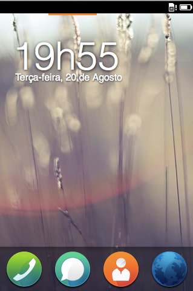

# Introduction {#introduction}

## Firefox OS

[Firefox OS](http://www.mozilla.org/firefox/os/) is a new mobile platform developed by [Mozilla](http://mozilla.org) and its partners. Devices running Firefox OS are already available in many countries and will reach even more places by the end of 2013.

Targeted at developing markets, Firefox OS has the mission to bring the next billion people online. To achieve this, Firefox OS devices are built to serve as a *great first smartphone* along with competitive pricing. Firefox OS devices should not be compared with high-end smartphones such as the Apple iPhone 5S and Samsung Galaxy S4; they are built to be an alternative to feature phones so that people using said devices are able to upgrade to a Firefox OS one at an affordable cost and receive the *full smartphone experience*.

In developing markets such as Brazil and Colombia, smartphones with decent performance are generally too expensive for the average consumer. People are able to buy cheap phones, but the platforms used in these phones are intended for high-end devices - as such, the phone's hardware tends to underperform, which leads to a terrible user experience. Firefox OS is specifically designed to run on limited hardware while providing a decent user experience. 

Another differentiating factor of Firefox OS is its openness. Consider that the current mainstream mobile operating systems are proprietary silos, where each vendor has the privilege to force his way on the developers and users regardless of their wishes (remember when Apple tried banning languages other than Objective-C from the iTunes App Store?). In those proprietary ecosystems you can only distribute your apps on authorized channels - and the vendor usually keeps a significant part of the the money from any purchases made on the device.

Besides locking the developers to proprietary distribution channels, these systems lock you to their software development kits (SDKs). If you want to build a native app for both iOS and Android using the official toolkits you will need to code one app using Objective-C and another with Java respectively. This means that, code-wise, a developer will reuse very little between projects (and maybe reuse some media assets). That kind of effort requires that the developer learns two languages and build the same software twice. 

Firefox OS differentiates itself by using "HTML5" as the development platform. HTML5 is a marketing term used to mean the ever-evolving collection of Web standards known as HTML, CSS and JavaScript. These royalty free standards are implemented by the major web browsers, and are what make web applications possible. By leveraging the technologies that encompass HTML5, millions of web developers are already able to code for Firefox OS. And apps built for Firefox OS are easy to port to another platform by using wrappers such as [Phonegap](http://phonegap.com).

## The Platform That HTML5 Deserves

The web is everywhere. Its on your computer, mobile phone, smart TV, and even in your video game consoles. The programming language of the web, JavaScript, is one of the most popular languages in the world. As already mentioned, when people talk about HTML5 they usually mean the collection of three technologies known as HTML, CSS and JavaScript. Recent advances in HTML have brought in a range of new features - advanced form controls, Web sockets, and more semantic markup - when compared to XHTML 1.0 and HTML 4.01. Advances in CSS have also introduced lots of new features, such as Flexbox and CSS Animations, that make it a lot easier to create beautiful responsive layouts. And recent advances in JavaScript have brought significant performance improvements and new capabilities, all while remaining easy to use for both beginners and seasoned developers alike.

Firefox OS is in essence, an extension of the mobile web. By making HTML5 a first class citizen, Mozilla has opened its platform to millions of web developers. Even if some other browser vendors implement HTML5 in their mobile offerings, Firefox OS goes beyond that by offering a collection of APIs to access the underlying hardware and system using JavaScript. These APIs are collectively known as the WebAPIs.

## Accessing The Hardware Using The WebAPI

Some earlier platforms also tried to create operating systems that used web technologies for app creation. For example, when the iPhone was introduced to the world, the only way to create apps was using web technologies. However, those web apps were limited in that they had no hardware or device access - meaning that only a limited range of applications could be built. When Apple then allowed developers to code apps in Objective-C, and also access the device's capabilities, it spurred a huge amount of innovation. Sadly, web apps did not gain access to the device's capabilities, and were thus left as "second-class citizens" - this made them unattractive to both users and developers alike, and unable to compete with native apps in that system.

When we say device capabilities we actually mean accessing hardware and OS level features and services: We're talking about things such as updating the address book, sending SMS, and accessing the camera and media gallery. On Firefox OS, the [WebAPI](https://developer.mozilla.org/en-US/docs/WebAPI)s are the means by which you will access many of those capabilities. 

Another earlier platform, WebOS, also offered hardware access via JavaScript but never tried to standardize its APIs. Mozilla is working with the W3C and other stakeholders to make sure that the WebAPIs are an open standard and that other browsers adopt them too. As these APIs are implemented by other browsers, your apps will require less and less changes to work across different platforms.

It's important to emphasize that the WebAPIs are not exclusive to Firefox OS devices. Mozilla is implementing it for the other platforms on which Firefox runs, such as desktop and android. This way, you can use your *open web app* in Firefox OS, Firefox on the desktop and Firefox for Android.

## Freedom to Develop and Distribute

Like everything that Mozilla does, Firefox OS is developed in the open and is free. All development can be followed on [the Mozilla B2G repository](https://github.com/mozilla-b2g/B2G) on GitHub. With Firefox OS you have the freedom to follow and contribute with the development of the system and you also have the freedom to distribute your applications on your own channels or on [The Firefox Marketplace](https://marketplace.firefox.com/). What's really awesome is that all the system applications are written in HTML5, so you can check them out and see how the are put together. 

The main idea is that you're not locked to Mozilla for anything. If you want to pick the source code for the system and change it for your own needs, so be it. If you need to build apps for internal use on your company, or if you want to distribute your creations only on your own web site, you're free to do it. Usually, in other platforms you're locked into the official app store as the only channel to distribute your apps. Firefox OS also has an official market called Firefox Marketplace which has an approval process but you're free to distribute your app outside this store if you want. Like in the web where you can host your web site anywhere you want, on Firefox OS you can do the same with your applications. 

This comes with a small caveat, sadly: some of the WebAPIs are too security sensitive to just allow anyone to use them. To distribute apps that use some of the more "privileged" APIs, you will need to get your applications signed and reviewed by Mozilla's staff. 

## Summary

HTML5 is here to stay and will only get better. Firefox OS is the new open mobile operating system by Mozilla completely based on web technologies. This system is built on the open and offers a robust HTML5 implementation that goes beyond the other platforms by offering the WebAPI which is a collection of APIs to access *hardware and operating system services using JavaScript*. These new APIs are being standardized through the World Wide Web Consortium (W3C) and will hopefully be adopted by other browsers in the future.

In the next chapter we'll quickly get you set up with everything you need to develop for Firefox OS. 
