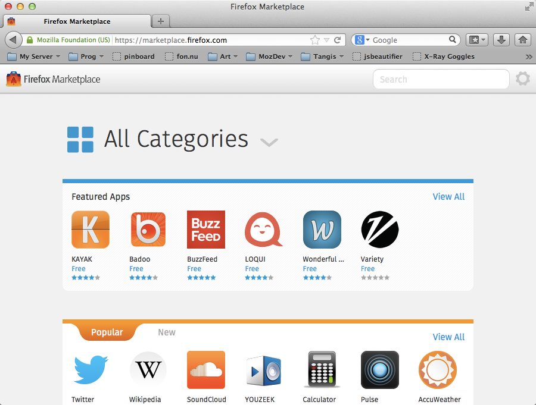
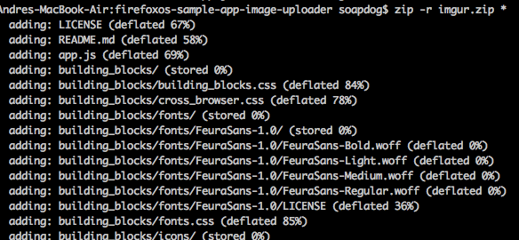
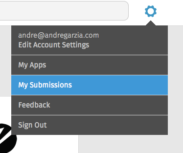
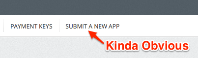
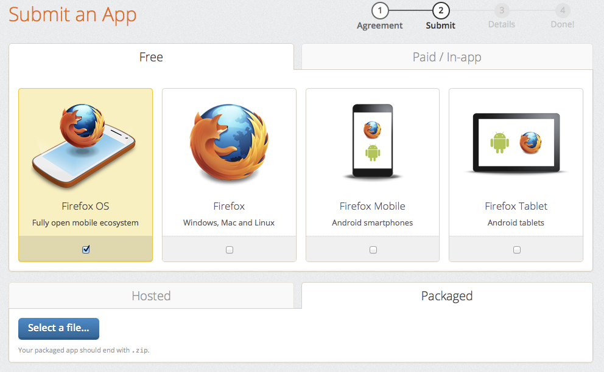
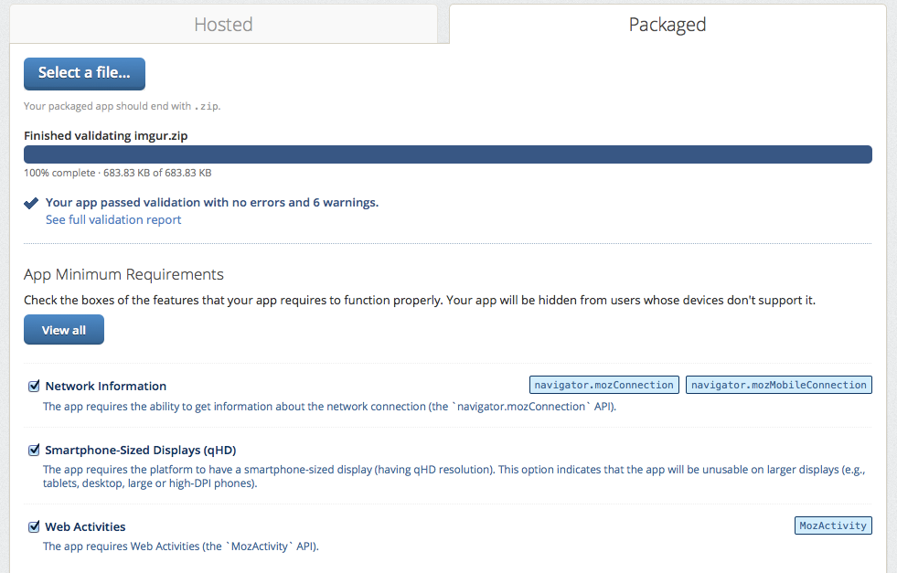
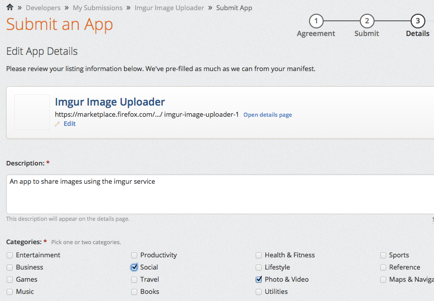

# The Firefox Marketplace

The [Firefox Marketplace](http://marketplace.firefox.com) is the online shop where you can buy or download applications for Firefox OS, Firefox, and Firefox For Android. This is the main channel for distributing Firefox OS applications, but you're not required to use it. If you want to distribute things outside the marketplace, read the [previous chapter](#distribution).

To place your apps on the marketplace you need to be identified via [Mozilla Persona](https://login.persona.org/about). Just click **Sign Up** and follow the instructions. Once you're identified, you will be ready to submit apps to the Firefox Marketplace.

## Checklist before even thinking about sending an app to the marketplace

All applications that are submitted to the marketplace go through an approval process (less scary than it sounds!). Hosted web applications go through a lighter process than privileged apps because they use less sensitive APIs. Before sending your application to the marketplace check out [the marketplace review criteria](https://developer.mozilla.org/en-US/docs/Web/Apps/Publishing/Marketplace_review_criteria). The most important parts are (IMHO): 

* Firefox OS devices do not have a **back button** like Android and your desktop browser. If the user navigates to a screen inside your app where there is no way for them to get back to the previous place  (i.e. the user gets stuck), your app will be rejected.
* Your app should have a 60x60 icon and clear descriptions.
* Your app should do what the description says. Saying one thing and providing something else will get your app rejected.
* If your app asks for a given permission then you should use it somewhere in your code. Flagging your application as a privileged app and not using any privileged app API will cause your app to be rejected with a request that you submit again as a plain app.
* Your application needs to have a *privacy policy* in place.
* Manifest files should be served with the correct MIME type and come from the same domain as the app for hosted apps.

There are other criteria discussed in the link above - and the rules can change without notice. It will be worth your time to read that page. Getting your application rejected because of small stuff that is easy to fix is a huge waste of time. Better get things right the first time (reviewers love to approve good apps!). 

## Preparing your app for submission

The steps required to submit your application to the marketplace are different depending on whether it's a hosted or a packaged app. For a hosted app, it  just needs to be accessible on the Internet with the correct MIME type and manifest in place. Packaged apps need to be compressed using *zip* and deserve some extra attention. 

Many developers make the mistake of selecting the folder containing the application files and zipping it. This causes the zip file to contain a folder and this folder to contain the app. This is not the correct way to zip a Firefox OS application. The correct way is to zip the files and folders needed so that the manifest is on the *root level* of the zip file. On Mac OS X and Linux you can use the terminal to navigate to your application folder and use a command such as `zip -r myapp.zip *` to compress things correctly as shown on the screenshot below.

This zip file is what we send to the marketplace.

## Submitting your app to the marketplace

Now with your application ready, and with the firm knowledge that it meets the review criteria, its time we send it to the marketplace. To do so browse to **My Submissions** using the gear button on the top of the marketplace page.

Inside the application management page, you need to click on **Submit An App** on the top menu.

This link will lead you to the form for submitting new apps, as seen in the screenshot below.

On this screen you will select the following options:

* If the application is hosted or packaged.
* If it is free or paid (or uses *in-app purchases*).
* What type of devices it is available for (Firefox OS, Firefox Desktop, Firefox for Mobile on phones, Firefox for Mobile on Tablets).

After making these choices you're driven to the second screen. On this book we're focusing on packaged apps but hosted apps are similar. 

In the remaining text of this chapter we're assuming that we're shipping a free Firefox OS packaged app. In this case we need to upload the zip file we prepared on the previous section.

After uploading the file, it undergoes an automated process and a report is shown with many options.

From the screen shot above we can see that the app I sent to the marketplace has no errors but contains six warnings. Ignoring the warnings for the sake of this text, lets check what the **minimum requirements** for this app are. In this case, the last option *Smartphone-Sized Displays (qHD)* should be unchecked because our application adapts to any screen size.

The next step is called **Step #3: Details** and it is where you fill the information about your application such as category, description, screen captures, etc.

After filling-in the details, the submission process is done. Now you just wait for the approval from the marketplace reviewers. Congratulations you shipped a Firefox OS application!!!

On the [Application Management page](https://marketplace.firefox.com/developers/submissions) you can check the status of your submissions and alter details if needed.

To learn more about submitting applications to the Firefox Marketplace read [this article on the Firefox OS developer hub](https://marketplace.firefox.com/developers/docs/submission).

## Summary

Congratulations!!! You have a new application on the Firefox Marketplace, you're exploring a brand new market!

I hope you enjoyed this quick guide. I plan to update and expand this guide often - so keep your eyes open and register for the updates. If you downloaded this book from Leanpub then its all good because you will receive emails about any updates. If you downloaded it from somewhere else then please consider fetching it from [the official page at Leanpub](http://leanpub.com/quickguidefirefoxosdevelopment) and registering your email. It's free and, no, you won't get any spam. Promise. 

Please send me feedback. This book was written by pulling all-nights before a tech conference so you can infer how much I enjoy this project and want to see it succeed. I can be reached for feedback on my Twitter account at [@soapdog](http://twitter.com/soapdog) and over email at [fxosquickguide@andregarzia.com](mailto:fxosquickguide@andregarzia.com). My home page is at [http://andregarzia.com](http://andregarzia.com).

Now that you're a part of the group of Firefox OS app creators, come be a part of the greater Mozilla community: Help keep the web free and open made by users for users. Join us at [http://www.mozilla.org/contribute/](http://www.mozilla.org/en-US/contribute/) and help Firefox OS grow!

