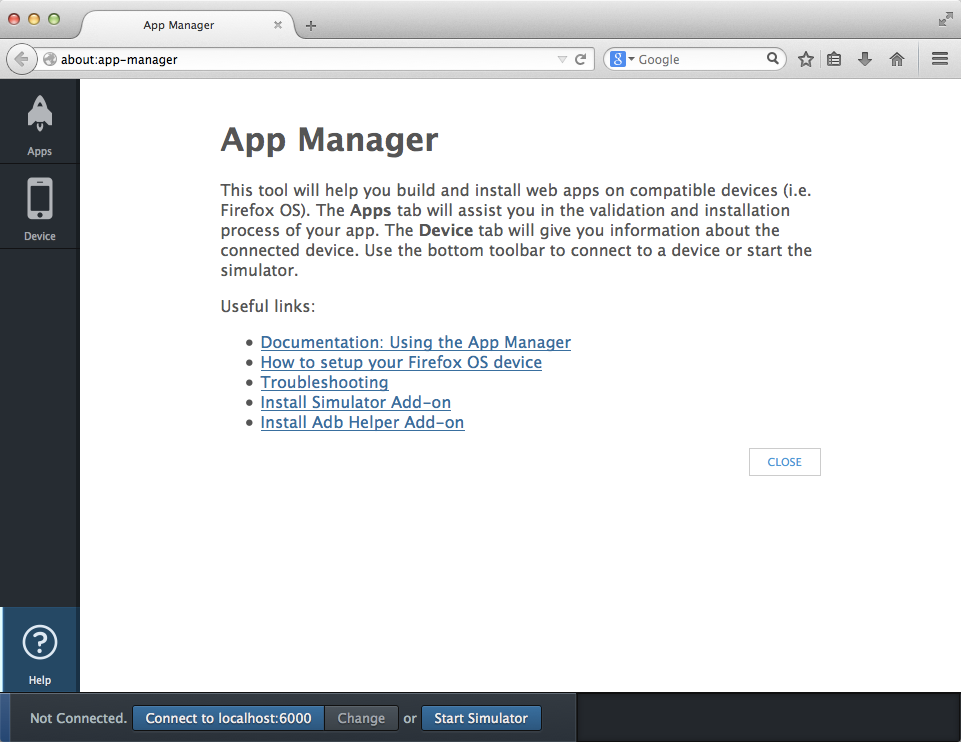
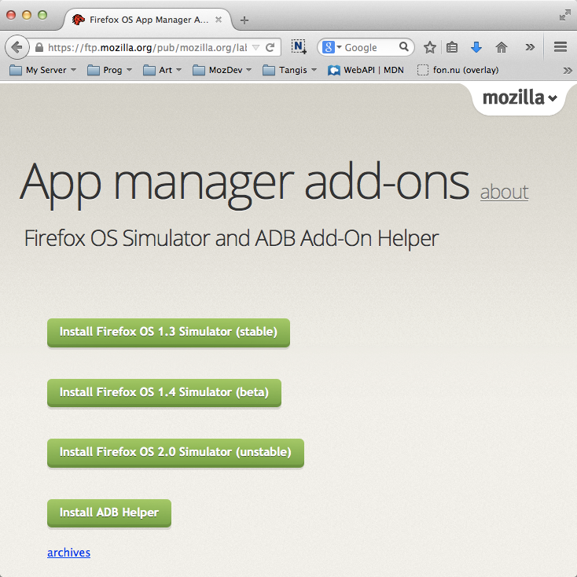
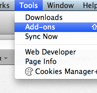
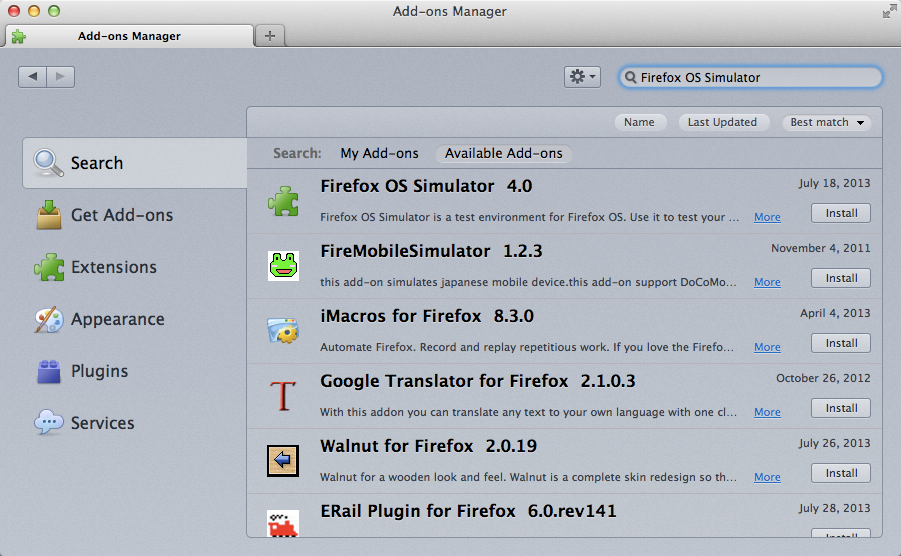

# Setup For Firefox OS App Development {#setup}

## The Gecko Engine
Browsers use different engines for rendering web pages: Google Chrome and Opera use Blink (a fork of WebKit), Internet Explorer uses Trident, while Safari uses WebKit. Mozilla has its own engine, called Gecko which is used in Firefox desktop, Firefox for Android, and Firefox OS. As these products use the same engine, it is possible to develop for Firefox OS using the Firefox desktop browser (but with some caveats[^engines]).

[^engines]: Although the same engine is used for all Mozilla products, the version of the engine in Firefox OS is generally behind that of the desktop browser. This is because the release cycle of Firefox OS is currently slower than that of the Desktop browser. In practice, this will mean that some features may not be available (or work as expected) when you try them out in Firefox OS - so always make sure you test your applications on a device that runs Firefox OS. Also, be mindful that users might also be on different versions of Firefox OS, so they might not have all the bleeding edge features. Be sure to always provide a fallback in case where some feature is unavailable.

## What applications do you need?

To develop and test apps made for Firefox OS you will need:

 * A recent version of the [Firefox Browser](http://getfirefox.com).
 * The [Firefox OS Simulator](https://addons.mozilla.org/en-US/firefox/addon/firefox-os-simulator/) if you're running a device with Firefox OS 1.1.
 * A text editor for programming[^editors].

Be aware that the **Firefox OS Simulator is made to work with devices running Firefox OS 1.0 up to 1.1, devices running Firefox OS 1.2+ will be tested using the App Manager** which we will talk more later.

When this book was first written **Firefox OS 1.1** was current and the official way of testing things was with the **Firefox OS 1.1 Simulator**. Mozilla is now transitioning to the new **App Manager** which is much better than the old simulator but unfortunately not able to connect to Firefox OS 1.1 devices.

Since there are a lot of people running Firefox OS 1.1 and most of the devices sold in the retails market are still 1.1 devices we'll keep the **Firefox OS 1.1 Simulator** instructions but we'll duplicate any section related to that simulator and also present how to do the same tasks in the **App Manager**. I will present the **App Manager** content first because thats the current stuff and then present the content for the old simulator.

The **App Manager** is bundled with **Firefox 29 or newer**. We'll describe it in detail on [the chapter about App Manager](#appmanager).

[^editors]: There are many good editors out there with different levels of complexity and features. A very popular one that I recommend for those that don't have a favorite one is [SublimeText](http://sublimetext.com/). Personally, I use [WebStorm](http://www.jetbrains.com/webstorm/) which is a complete IDE for web app creation.

## App Manager Setup

If you're running the current version of Firefox (a.k.a. 29 or newer) then you have the App Manager available to you. Having the App Manager is not enough though. You still need to install the simulators on the App Manager itself to be able to test things without hooking a device to your machine. Mozilla has [extensive documentation about the App Manager](https://developer.mozilla.org/en-US/Firefox_OS/Using_the_App_Manager) so if you want to dive a bit deeper check it out.

The App Manager is able to manage multiple Firefox OS versions so you can install simulators for version 1.3, 1.4 and 2.0, remember that the higher the version number the earlier it is. And by earlier I mean buggy but since we can have multiple versions then we should just install them all so that we're able to test our apps with different Firefox OS versions.

Lets take the new App Manager for a spin and install the stuff we'll need for later. To launch the App Manager go to the menu **Tools -> Web Developer -> App Manager**.

After you launch the App Manager you will see a screen like this

You need to click the **Install Simulator** button and select the versions you want to install.

The App Manager uses ADB to communicate with connected devices. It is able to handle all the ADB stuff for you if you install the **ADB Helper Add-on** available at [Install the ADB Helper add-on](https://ftp.mozilla.org/pub/mozilla.org/labs/fxos-simulator/).

My recommendation is to install all available versions of the simulator and the ADB Helper.

## Installing the Firefox OS Simulator

If you have a device running **Firefox OS 1.1** then you need to install the **Firefox OS 1.1 Simulator** because your device can't communicate with the new **App Manager**.

After installing Firefox, the next step is the installation of the Firefox OS Simulator that will be used to test our applications. With Firefox installed and running, go to the **Tools** menu and select **Add-ons**.

Using the search box on the top right corner, search for **Firefox OS Simulator** and install the add-on by clicking the install button.

W>Attention: If you're running **Firefox 29 or newer** and you have a device running **Firefox OS 1.1 or earlier** then you will need another version of the **Firefox OS 1.1 Simulator** that is not currently listed on the add-ons marketplace. This version is **BETA** but its the best we've got right now. You can fetch it for [Mac OS X](http://ftp.mozilla.org/pub/mozilla.org/labs/r2d2b2g/r2d2b2g-5.0pre7-mac.xpi), [Linux](http://ftp.mozilla.org/pub/mozilla.org/labs/r2d2b2g/r2d2b2g-5.0pre7-linux.xpi) or [Windows](http://ftp.mozilla.org/pub/mozilla.org/labs/r2d2b2g/r2d2b2g-5.0pre7-windows.xpi). Just drop the xpi file on Firefox and follow the installation instructions. If you want to follow up on the quest of making the **Firefox OS 1.1 simulator** work on **Firefox 29** then check out [bug request #1001590 it](https://bugzilla.mozilla.org/show_bug.cgi?id=1001590).

After the installation of the add-on, you will be able to access the simulator by going to the menu **Tools -> Web Developer -> Firefox OS Simulator**.

Alternatively, you can navigate to the [Firefox OS Simulator](https://addons.mozilla.org/en-US/firefox/addon/firefox-os-simulator/) addon page, and download the simulator from there.

## Summary

In this chapter we learned that all we need to develop Firefox OS apps is the Firefox browser, the App Manager and Firefox OS Simulators (and a good text editor).

Now that we have setup all the tools we need, lets learn some basic concepts before we build our first app.
