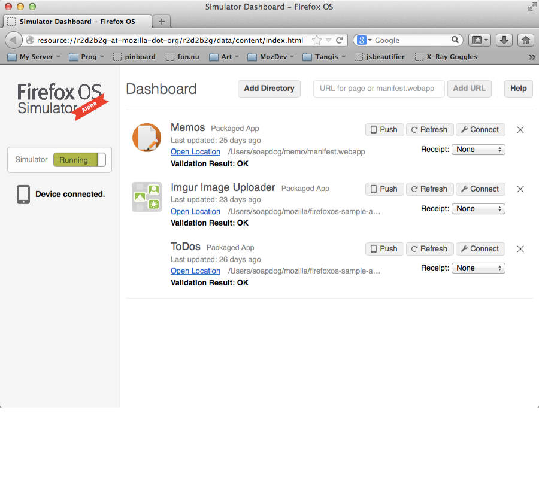
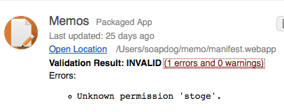
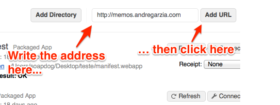
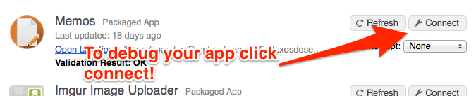
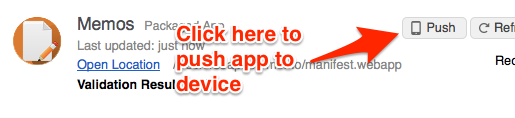
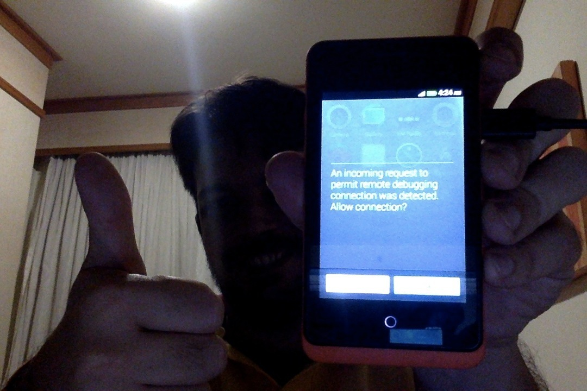

# The Firefox OS Simulator {#simulator}

W>Attention: This chapter is here for compatibility with devices running Firefox OS 1.1. The current method for testing and debugging apps is the **App Manager** which we talked about in the previous chapter. The content of this chapter is just for people testing stuff on Firefox OS version 1.1.

W>Attention: If you're running **Firefox 29 or newer** and you have a device running **Firefox OS 1.1 or earlier** then you will need another version of the **Firefox OS 1.1 Simulator** that is not currently listed on the add-ons marketplace. This version is **BETA** but its the best we've got right now. You can fetch it for [Mac OS X](http://ftp.mozilla.org/pub/mozilla.org/labs/r2d2b2g/r2d2b2g-5.0pre7-mac.xpi), [Linux](http://ftp.mozilla.org/pub/mozilla.org/labs/r2d2b2g/r2d2b2g-5.0pre7-linux.xpi) or [Windows](http://ftp.mozilla.org/pub/mozilla.org/labs/r2d2b2g/r2d2b2g-5.0pre7-windows.xpi). Just drop the xpi file on Firefox and follow the installation instructions. If you want to follow up on the quest of making the **Firefox OS 1.1 simulator** work on **Firefox 29** then check out [bug request #1001590 it](https://bugzilla.mozilla.org/show_bug.cgi?id=1001590).

We've installed the Firefox OS Simulator in [the chapter about preparing the environment](#setup) and we used it on the [chapter about building our first app](#firstapp). Now we're going to take a deeper look into the simulator features and learn how to do the most common tasks.

To learn more about it, check out [the Firefox OS Simulator documentation](https://developer.mozilla.org/en-US/docs/Tools/Firefox_OS_Simulator) on MDN.

Remember that if you are using a device running Firefox OS 1.2+ then you need to use the App Manager with it and not the Firefox OS Simulator. The App Manager was described in the previous chapter.

## Adding Apps

You can add both hosted and packaged apps to the simulator. Lets see how to add each type of app.

### Adding packaged apps

You already saw how to add packaged apps to the simulator during [our first app creation](#firstapp), but we're going to do a recap so I can show you what else is possible.

To add a new packaged application click the **Add Directory** button on the **Simulator Dashboard** as shown in the screenshot below.

When you click on the button highlighted on the image, Firefox opens a file selection dialog. You should browse your hard drive and select the **app manifest file** for the application that you want to add to the simulator. If there are no issues with your manifest and your start file is ok, the application will be added and the simulator will launch with your app running. If there is anything wrong with your manifest, or some other issue, then an error report will be shown on the dashboard.

Whenever you update your application you should click **Refresh** to update the version of the app on the simulator (you can also press CMD/CTRL+R on the simulator window to refresh).

### Adding hosted apps

If you're building a hosted app then you should test it by using a web server. Do not try to use the method described above for hosted apps because you may miss some errors that will only happen on a hosted environment - such as serving the manifest with the wrong *MIME type*. Note that the simulator won't warn you about things like incorrect MIME types, but it's important to get such things right if you submit your app to the Mozilla Marketplace.

Most of the hosted apps are not applications built exclusively for Firefox OS but responsive design based websites that are able to adapt themselves to different devices and resolutions. These web apps usually have a complex backend that needs to be in-place for the application to work and that's why you need to test the app using a real web server running your backend stuff.

To run your app in the simulator, fill the URL of your application in the text entry box on the top and click the **Add URL** button.

After clicking the button, the manifest is verified and if it is correct the application is added and the simulator is launched with your application running. Like when we're adding packaged apps, if something wrong happens with in the manifest you will see a report (e.g. "app submission to the marketplace needs at least an 128 icon").

As with packaged apps, whenever you update your application you should click **Refresh** to update the version of the app on the simulator (you can also press CMD/CTRL+R on the simulator window).

## Debugging

After the application is added to the simulator we're able to debug it by clicking the **Connect** button next to the application listing on the dashboard. This will launch the simulator with your application running and the **JavaScript Console** open and connected to your app.

After pressing this button you will see a screen like this:

With the tools connected to your app you can test your JavaScript, debug your DOM, edit styles, etc. Like those startup guys like to say: *pivot until your app is good*.

Once your app is running well on the simulator it's time to test on a real device.

## Testing apps on a real device

Nothing replaces testing on a real device. On the simulator, you test things by using a mouse and clicking on a computer screen; while on a real device you use your fingers on a touchscreen and by using physical buttons. Its a very different user and development experience.

As an example why this type of testing matters, let me tell you a brief story: Some years ago,   Raphael Eckhardt (the designer who created the cover of this book) and I were building a puzzle game not that disimilar to Bejeweled. Our game involved dragging and dropping some pieces on a board and was working pretty well on the simulator.

When we then tested the game on an actual phone we realized our game components were not touch friendly at all: when placing a hand over the screen the board would vanish behind the hand. Even worst, the pieces the users were supposed to drag were smaller than the user's finger tip, so the user couldn't see what they were doing! In summary, our UX sucked very badly. That happened because we're kept trying things only on the simulator with a mouse that used a tiny cursor. When we decided to try with our fatter-than-a-cursor fingers we realized that we need to rework our UI.

To avoid having a similarly depressing experience, always test on a real device... or two, or more if you can get your hands on some. And test often with simple prototypes: otherwise, you can waste valuable time and money having to recreate assets.

You can buy a developer preview phone running Firefox OS from the [Geeksphone Shop](http://shop.geeksphone.com/en/). I recommend using a [Geeksphone Keon](http://www.geeksphone.com/) because this device has similar specs to the devices that are being launched by Mozilla's partners.

You can also buy a device targeted at consumers if you happen to live in one of the countries where they are already available. A third way is that you can replace Android with Firefox OS on some devices (some specific devices only, chance of bricking, don't blame me!) - but I don't recommend this unless you're a power user and like to spend a lot of time hacking.

## Connecting with a Firefox OS device

If you have a Firefox OS device (and have any needed drivers installed) then you can push apps directly from the simulator to the device if the device is connected to your computer. When the simulator detects that you plugged a Firefox OS phone, it will display a notice saying **Device Connected**.

If your phone is connected (and detected) the simulator will add a new button next to **Refresh** and **Connect** called **Push**. When you press this button, a **permission request dialog** appears on the device screen asking for confirmation to install the pushed app.

And below we can see the permission request screen.

With the application running on the device you can use *remote debugging* to connect a JavaScript console and debug the app.

## Summary

In summary, the Firefox OS Simulator is awesome for building Firefox OS specific apps - but has some limitations if you are trying to build for a range of devices (e.g. currently, you can't emulate what Firefox OS would feel like on a tablet).

Besides feeling awesome and empowered, by this point in the book you hopefully have a good grasp of the workflow for building apps for Firefox OS.

In the next chapter we'll talk about the new app manager which is the new system that Mozilla is building to debug apps. It has more features than using just the Firefox OS Simulator.
